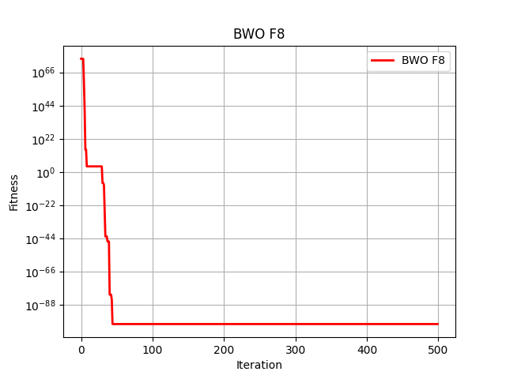
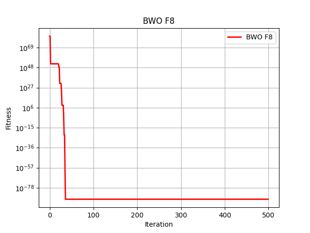
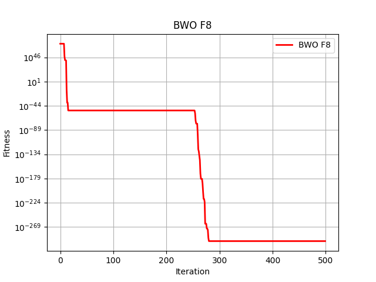
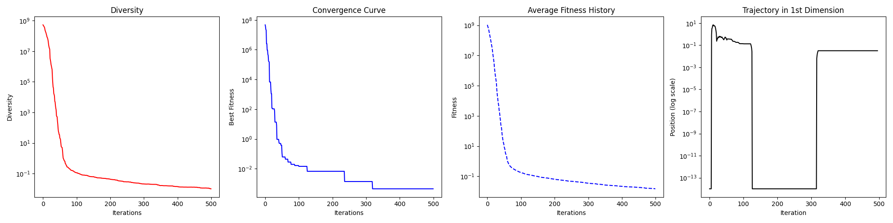

# 实验汇报
本实验用来探索四种智能群体算法各自的性能及优缺点，包括了白鲸寻游算法(BW)，
冠豪猪优化算法(CPO)，山瞪羚优化算法(MGO)和蒲公英优化器(DO)。
本实验将从三个角度去判断一个模型的性能，分别是： 

- **规定迭代次数内的全局最优解**
- **算法执行的时间**
- **得到最优解的迭代次数**

由于函数最优解的求解过程具有随机性，所以将对每个算法执行5遍，取所有结果的平均值。

## BWO

|   |最佳结果|得到最佳结果的迭代次数| 执行有限次迭代所用的时间(500次) |
|---|---|----|--------------------|
| 1 |3.96823252e-158|32| 30.24s             |
|2| 1.74668708e-101|44| 33.28s             |
|3|8.95771806e-091|36| 32.69s             |
|4|6.64274416e-110|68| 31.44s             |
|5|6.58090565e-296|280| 34.39s              

平均得到最优解的次数为：92次

平均迭代用时为：32.40s

 

## CPO
|   |最佳结果| 得到最佳结果的迭代次数 | 执行有限次迭代所用的时间(500次) |
|---|---|-------------|--------------------|
| 1 |0.00044338| 319         | 4.9s               |
|2| 0.00365448| 468         | 5.0s               |
|3|0.00111443| 445         | 5.03s              |
|4|0.00147803 | 485         | 5.07s              |
|5|0.00154472| 285         | 4.97s             

平均得到最优解的次数为:400

平均迭代用时为：4.99s

  
  
  
  
  

