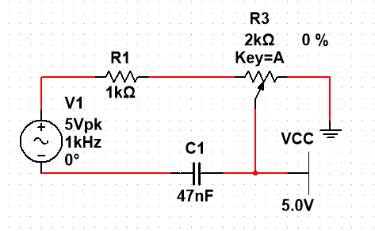

# 
Lab1 Potentiometers Part1

Jairui Huang(黄家睿)

202283890036

## Introduction and Aim
This experiment explores the behaviour of a simple RC (Resistor-Capacitor) circuit and 
understand its response to changes in input voltage. To achieve this, we will use a linear 
potentiometer as a variable resistor in the circuit.
A potentiometer, oBen referred to as a pot, is a three-terminal resistor with an adjustable tap 
that allows us to change the resistance value along its length. In this experiment, we will utilize 
a linear poten@ometer to vary the resistance in the RC circuit. By adjusting the potentiometer, 
we can control the rate at which the capacitor charges and discharges, thus influencing the 
time constant and the behaviour of the circuit.

   
## Circuit Diagram
The circuit diagram is created in Multisim.

    

## Data_Table 
|  kHZ| Potentiometer perc | Vp    |Vc   |Vp/Vc|
|-----|--------------------|-------|-----|-----|
|1kHZ |    0%              | 4.43V |7.47V|0.59 |
|1kHZ |    20%             | 3.75V |7.90V|0.47 |
|1kHZ |    40%             | 2.97V |8.37V|0.35 |
|1kHZ |    60%             | 2.09V |8.82V|0.23 |
|1kHZ |    80%             | 1.09V |9.22V|0.11 |
|1kHZ |    100%            | 0.69V |9.58V|0.07 |
|2kHZ |    0%              | 5.80V |4.89V|1.18 |
|2kHZ |    20%             | 5.15V |5.43V|0.94 |
|2kHZ |    40%             | 4.33V |6.09V|0.35 |
|2kHZ |    60%             | 3.23V |6.82V|0.47 |
|2kHZ |    80%             | 1.82V |7.69V|0.23 |
|2kHZ |    100%            | 1.24V |8.60V|0.14 |
|5kHZ |    0%              | 6.50V |2.19V|2.96 |
|5kHZ |    20%             | 5.96V |2.51V|2.37 |
|5kHZ |    40%             | 5.21V |2.93V|1.77 |
|5kHZ |    60%             | 4.15V |3.50V|1.18 |
|5kHZ |    80%             | 2.57V |4.34V|0.59 |
|5kHZ |    100%            | 2.02V |5.59V|0.36 |
|10kHZ|    0%              | 6.61V |1.12V|5.90 |
|10kHZ|    20%             | 6.08V |1.28V|4.75 |
|10kHZ|    40%             | 5.37V |1.51V|3.55 |
|10kHZ|    60%             | 4.36V |1.84V|2.36 |
|10kHZ|    80%             | 2.78V |2.34V|1.18 |
|10kHZ|    100%            | 2.31V |3.19V|0.72 |
|20kHZ|    0%              | 6.66V |0.56V|11.8 |
|20kHZ|    20%             | 6.14V |0.64V|9.59 |
|20kHZ|    40%             | 5.44V |0.76V|7.15 |
|20kHZ|    60%             | 4.42V |0.93V|4.75 |
|20kHZ|    80%             | 2.83V |1.19V|2.37 |
|20kHZ|    100%            | 2.40V |1.66V|1.44 |
|50kHZ|    0%              | 6.66V |0.23V|28.9 |
|50kHZ|    20%             | 6.15V |0.26V|23.6 |
|50kHZ|    40%             | 5.45V |0.31V|17.6 |
|50kHZ|    60%             | 4.44V |0.38V|11.7 |
|50kHZ|    80%             | 2.85V |0.48V|5.93 |
|50kHZ|    100%            | 2.44V |0.67V|3.64 |
|100kHZ|    0%              | 6.66V |0.11V|60.5 |
|100kHZ|    20%             | 6.15V |0.13V|47.3 |
|100kHZ|    40%             | 5.45V |0.15V|36.3 |
|100kHZ|    60%             | 4.44V |0.18V|24.6 |
|100kHZ|    80%             | 2.86V |0.24V|11.9 |
|100kHZ|    100%            | 2.44V |0.34V|7.17 |

## Discussion
From the data above, it can be observed that as the proportion of the potentiometer increases,Vp gradually decreases, Vc gradually increases, and the ratio of Vp to Vc continuously decreases.
As the frequency of the signal generator increases, the Vp/Vc ratio at the same potentiometer proportion also increases. For instance, at 1 kHz with a potentiometer proportion of 20%, the Vp/Vc ratio is 0.47, whereas at 10 kHz with the same potentiometer proportion, the Vp/Vc ratio increases to 4.75, which is 100 times larger compared to 0.47.
However, with further increases in the signal generator frequency, Vp no longer changes. From the data at 50 kHz and 100 kHz, it can be seen that Vp remains the same for each potentiometer proportion.
|  kHZ| Potentiometer perc | Vp    |Vc   |Vp/Vc|
|-----|--------------------|-------|-----|-----|
|50kHZ|    0%              | 6.66V |0.23V|28.9 |
|50kHZ|    20%             | 6.15V |0.26V|23.6 |
|50kHZ|    40%             | 5.45V |0.31V|17.6 |
|50kHZ|    60%             | 4.44V |0.38V|11.7 |
|50kHZ|    80%             | 2.85V |0.48V|5.93 |
|50kHZ|    100%            | 2.44V |0.67V|3.64 |
|100kHZ|    0%              | 6.66V |0.11V|60.5 |
|100kHZ|    20%             | 6.15V |0.13V|47.3 |
|100kHZ|    40%             | 5.45V |0.15V|36.3 |
|100kHZ|    60%             | 4.44V |0.18V|24.6 |
|100kHZ|    80%             | 2.86V |0.24V|11.9 |
|100kHZ|    100%            | 2.44V |0.34V|7.17 |