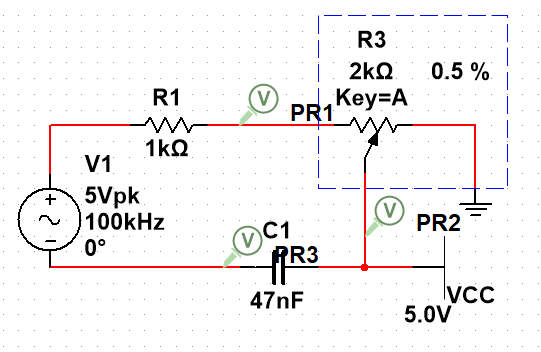
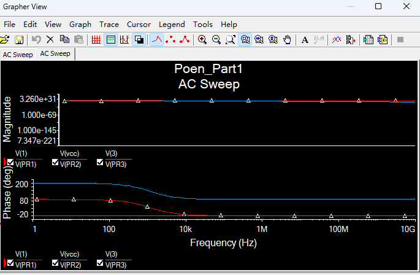
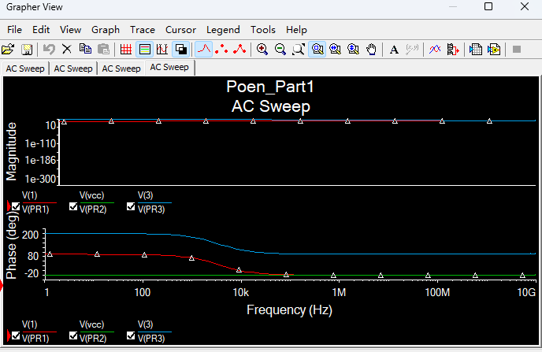

# 
AC Sweep simulation

Jiarui Huang(黄家睿)

202283890036

## Introduction and Aim
This experiment explores the behaviour of a simple RC (Resistor-Capacitor) circuit and 
understand its response to changes in input voltage. To achieve this, we will use a linear 
potentiometer as a variable resistor in the circuit.
A potentiometer, oBen referred to as a pot, is a three-terminal resistor with an adjustable tap 
that allows us to change the resistance value along its length. In this experiment, we will utilize 
a linear poten@ometer to vary the resistance in the RC circuit. By adjusting the potentiometer, 
we can control the rate at which the capacitor charges and discharges, thus influencing the 
time constant and the behaviour of the circuit.

## Theory
the cut-off frequency fc is defined the point at which the output voltage is equal to -3 dB (or 70%) of the input voltage, where:
$$
f_c = \frac{1}{2\pi RC}
$$

## Circiut Diagram

    

## The output of the AC sweep simulation
This diagram show the the circuit’s response and determine the cut-off frequency with the potentometer of 0.5%.

    

This diagram show the the circuit’s response and determine the cut-off frequency with the potentometer of 100%.

    

