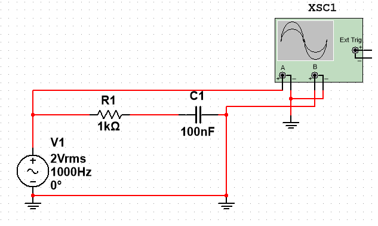
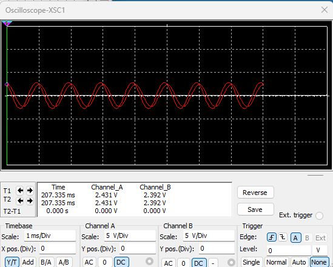
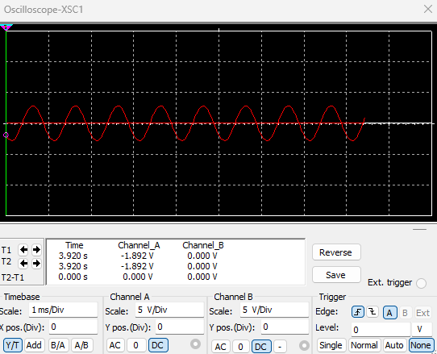

# 
RC Circuit measurement

Jiarui Huang(黄家睿)

202283890036

## Lab content
1. Set the voltage output from the function (signal generator) to be approximately 2V. (Use CRO)
2. Set the frequency of the function generator to 1 kHz (Use CRO)
3. Choose appropriate R and C values for the circuit.
4. Measure and record the peak values of VS, VR and VC in table 1.
5. Measure and record the time lag tR and tC, with the total voltage as a reference value, in table 1. Note whether this value is positive or negative.
6. Repeat the measurements at a frequency of 5 kHz and record the values in table 1.

## Theory
An RC circuit is a basic circuit unit composed of a resistor R and a capacitor C , used for signal processing, filtering, time delay, etc. 
### 1.Time Constant$\tau$
The time constant describes the dynamic response of an RC circuit and is defined as: 
$\tau = R \times C$

### 2. Cutoff Frequency$f_c$
For an RC filter, the cutoff frequency is the frequency where the circuit starts to significantly attenuate the signal, defined as:  
$$
f_c = \frac{1}{2\pi RC}
$$
Low-pass filter:$f \leq f_c$will pass through, while signals with $f \geq f_c$will be attenuated.
High-pass filter:$f \geq f_c$will pass through, while signals with$f \leq f_c$will be attenuated.

### 3.Impedance 
In AC circuits, the total impedance of an RC circuit is the combination of the resistance R and the capacitive reactance $X_C$ :  
$$
Z_T = Z_R + Z_C = R\angle0 \omega + X_C\angle - 90 \omega = R - jX_C
$$
​
### 4.Voltage-Related Parameters
#### 4.1Power Supply Voltage $V_S
This is the input voltage provided to the circuit, typically supplied by a signal generator or a DC power source. $V_S$ is a known external parameter. $V_s$is a known external parameter.
#### 4.2Voltage Across the Resistor $V_R$
According to Ohm's law, the voltage across the resistor is:
$$
V_R=I \cdot R
$$
where 𝐼 is the current in the circuit and 𝑅 is the resistance.
#### 4.3 Voltage Across the Capacitor $V_C$
The voltage across the capacitor depends on its charging or discharging state:
During charging:
$$
V_C(t)=V_S \cdot (1-e^\frac{-t}{\tau})
$$
During discharging:
$$
V_C(t)=V_c0 \cdot e^\frac{-t}{\tau}
$$
Here, $\tau=R \cdot C$ is the time constant, and $v_C0$ is the initial voltage.

#### Time Period 𝑇 and Frequency 𝑓
If the circuit uses an AC power source, the time period and frequency are determined by the input signal:
Time Period:
$$
T=\frac{1}{f}
$$
Frequency:
$$
f=\frac{1}{T}
$$
The input signal can be a sine wave, square wave, or other waveforms, with its frequency set by the signal generator.

## Circiut Diagram

## Data Table
| $V_S (V)$ | $V_R (V)$ | $V_C (V)$ | $\tau_R$ | $\tau_C$ | $T (ms)$ | $f (Hz)$ |
|-----------|-----------|-----------|----------|----------|----------|----------|
|    2V     |  1.26V    |    2V     |   0.1ms  |   0.1ms  |   1ms    |   1kHz   |
|    2V     |  605mV    |    2V     |   0.1ms  |   0.1ms  |   0.2ms  |   5kHz   |

