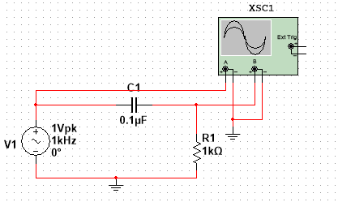
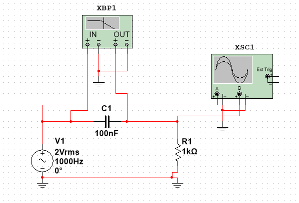
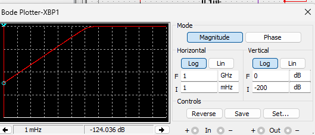
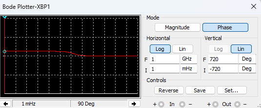
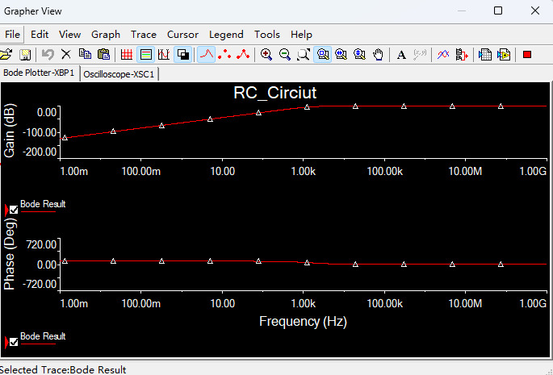

# 
Introduction to using Multisim

Jiarui Huang(黄家睿)

202283890036

## Introduction and Aim
In this experiment, we will use the simulation software Multisim to construct an RC circuit and conduct detailed analysis and testing. Specifically, we will design a simple circuit model consisting of a resistor and a capacitor to explore its dynamic response characteristics under different input conditions. The main objective of this experiment is to help understand the fundamental principles of RC circuits, including time constants, filtering effects, and their applications in signal processing. By adjusting the parameters of the resistor and capacitor, we will also observe changes in circuit behavior, thereby deepening our understanding of the characteristics of RC circuits and their practical applications.

## Circuit diagram
In this section, we constructed an RC circuit that includes a 1k$\Omega$ resistor and a 0.1$\mu$F capacitor. The DC power supply was set to 1V and 1kHz, and measurements were taken using an oscilloscope. The recorded data is shown as follows:

    

    

## data table
| $V_S (V)$ | $V_R (V)$ | $V_C (V)$ | $\tau_R$ | $\tau_C$ | $T (ms)$ | $f (Hz)$ |
|-----------|-----------|-----------|----------|----------|----------|----------|
|    2V     |  1.26V    |    2V     |   0.1ms  |   0.1ms  |   1ms    |   1kHz   |
|    2V     |  605mV    |    2V     |   0.1ms  |   0.1ms  |   0.2ms  |   5kHz   |

From the data, we can observe that it closely resembles the data we measured.

## Circiut Diagram for Bode Ploter
The Bode Plotter's oscilloscope can be used to observe the input and output waveforms of the Bode Plotter in real-time, helping to understand the changes in amplitude and phase of the signal after passing through the circuit.

    

    

    

    

