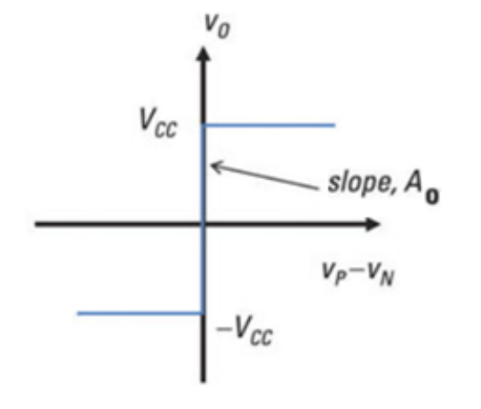
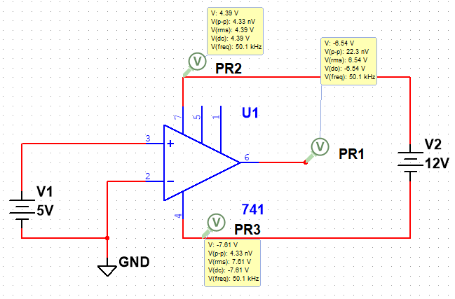

# 
Operational Amplifiers

Jairui Huang(黄家睿)

202283890036

## Introduction and Aim
In this lab, we will use the 741 operational amplifier (op-amp) to demonstrate its versatility in various electronic applications. The 741 op-amp is one of the most widely used op-amps due to its reliability and ease of use in both analog signal processing and control systems. Throughout the experiment, we will explore its fundamental properties and characteristics, such as voltage gain, input impedance, and output voltage swing.

## Experimental Method and Result
The 741 Operational Amplifier (opamp) is a high gain voltage amplifier. The inputs to the amplifier consist of 𝑉+ (non-inverting input) and 
a 𝑉− (inverting input). 
The main properties of the 741 op amp are:
* High open-loop gain: $𝐴_𝑜 ≈ 2 × 105$
* Unity gain bandwidth: $𝐵 ≈ 2 × 106 Hz$
* High input impedance: $𝑍_𝑖 ≈ 106 Ω$
* Low output impedance: $𝑍_𝑜 ≈ 100 Ω$

## part1: Non-inverting operational amplifier in open loop configuration
In this part, we establish a basic open-loop amplification circuit, using a 12V DC power supply to power the operational amplifier: connect the positive terminal to pin 7 and the negative terminal to pin 4. The operational amplifier is connected in an open-loop configuration, and a DC power supply provides +5V while appropriately grounding the circuit. 

Next, we will measure the voltage values of $V_cc+$ and $V_cc-$, and record the positive saturation voltage. Then, we will change the input power to -5V and compare the positive voltage values, noting the differences between $V_cc+$ and $V_cc-$.

### Theory
The output voltage of the op-amp is given by the equation:
$$
V_o=A_v(V_+ - V_-)=A_v \cdot V_d 
$$
where:
$𝑉_+$ is the voltage at the non-inverting terminal,
$𝑉_−$ is the voltage at the inverting terminal 
$𝐴_𝑜$ is the open-loop gain of the amplifier 
$𝑉_𝑑$ is the differential input (i.e. 𝑉+ − 𝑉−)
$𝑉_𝑐𝑐+$is +12V power input
$𝑉_𝑐𝑐−$is -12V power input

When the op-amp is on open-loop configuration, due to the very high open 
loop gain of the amplifier there is a very limited linear region. The higher 
the gain of the amplifier, the larger the slope of the linear region and the 
closer the line becomes to a vertical as shown below.

    

### circiut Diagram

    

At positive saturation the output voltage produce approaches the 
maximum positive supply voltage $𝑉_𝑐𝑐+$. At negative saturation the output 
voltage produce is close to the maximum negative voltage $𝑉_𝑐𝑐−$.

### data table
|input value|$V_cc+$|$V_cc-$|positive saturation voltage|negative saturation voltage|
|-----------|-------|-------|---------------------------|-----------------------------|
|      5    |  4.39 | -7.61 |    11.4                   |    None|
| -5        |  -0.61|-12.6  |   None                    |    -11.5|

We can observe that both the positive saturation voltage and the negative saturation voltage are close to the supply voltage value of 12V.

## Conclusion
This experiment was successfully completed, comprehensively and accurately grasping the
input-output characteristics and saturation voltage details of the 741 operational amplifier
in the open-loop configuration. The principle mechanism that the high gain leads to
a narrow linear region and saturation phenomenon, as well as the internal transistor
saturation voltage drop causing the difference between the output and the power supply
voltage, was clearly defined, laying a solid theoretical and practical foundation for the
application of the amplifier in complex circuit design.

