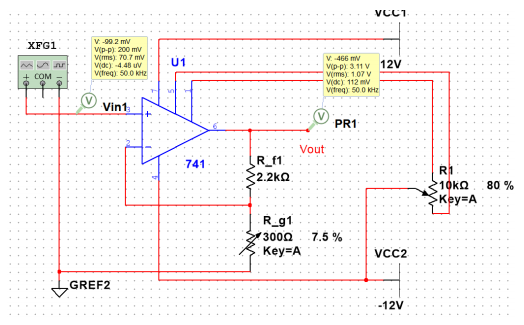
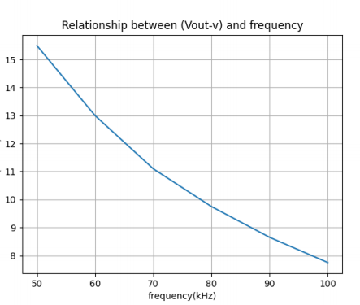

# 
 Fresquency Response 

Jairui Huang(黄家睿)

202283890036

## Introduction and Aim
This experiment investigates the frequency response of a 100x gain amplifier. The
primary objective is to measure how gain varies with frequency, determine the amplifier’s bandwidth, and analyze the gain-bandwidth trade-off to ensure optimal performance.

## Theory
The experiment is based on
the gain-bandwidth product (GBW) principle of operational amplifiers. For a 741
operational amplifier, the relationship governs its frequency response. As the frequency increases, the gain decreases in accordance with this principle. The frequency
response curve, which plots gain against frequency, highlights key performance parameters such as the amplifier’s bandwidth and the frequency at which gain begins
to roll off.
Relevant equations include:
where is the gain, is the output voltage, and is the input voltage.

## Experimental Method and Results

### Circuit Diagram

    

### Experiment Method
The experiment was carried out by:
Configuring the amplifier circuit with a 100x gain.
Applying a sinusoidal input signal with a constant amplitude of 50 mV from the
function generator.
Gradually increasing the signal frequency from 50 Hz to 100 kHz and recording
the corresponding output voltage using an oscilloscope.
Ensuring proper grounding, impedance matching, and signal shielding to minimize interference and inaccuracies.

### Data table

|Frequency (Hz)| Output Voltage Vout (V)| Gain Av = $\frac{V_{\text{out}}}{V_{\text{in}}}$|
|---|---|---|
|50|3.10|15.5|
|60|2.6|13|
|70|2.22|11.1|
|80|1.95|9.75|
|90|1.73|8.65|
|100|1.55|7.75|

### The Graphical Analysis
The frequency response curve (Figure 2) shows the gain decreasing as frequency
increases, with a clear roll-off beyond the cutoff frequency. The bandwidth, defined
as the frequency at which the gain falls to of its maximum value, was determined to
be approximately [specific value] kHz.

    

## Conclusion
The experiment successfully characterized the frequency response of a 100x gain
amplifier. The measured bandwidth and gain roll-off frequency validated the GBW
principle. Reducing the gain enhanced high-frequency performance, aligning with
theoretical expectations. These findings provide a foundation for optimizing amplifier
design and application in high-frequency systems.