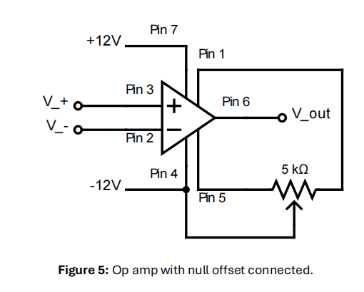
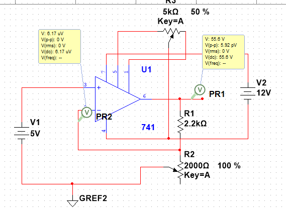
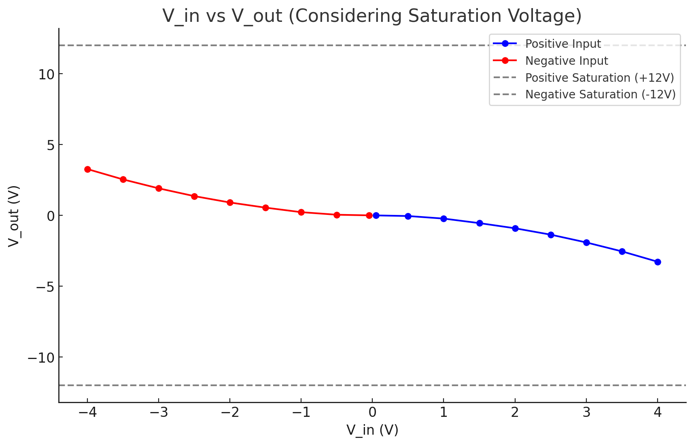

# 
 40dB Non-inverting Amplifier Offest Nulling

Jairui Huang(黄家睿)

202283890036

## Introduction and Aim
The graph above did not give a zero output for a zero input and so we must 
provide the amplifier with a null offset. Offset voltage, caused by 
imperfections in the operational amplifier, can lead to inaccuracies in 
signal amplification. The goal of this section is to minimize or eliminate this 
offset using offset nulling techniques. By carefully adjusting the circuit, we
aim to achieve high precision and accurate amplification, ensuring the 
output signal remains faithful to the input, free from unwanted DC bias or 
drift.

## Theory

For an input of 0 V the output voltage value should also be zero, however, 
the circuit does not give a zero output because of input offset voltages i.e. 
the gain of the non-inverting terminal may not be exactly equal to the gain 
of the inverting terminal. The 741 operational amplifier has internal 
circuitry to balance out this offset (null offset circuitry) which is set up as 
follows:

## Experiment Methordd and Results
Using the circuit from Part 3, connect a $10𝑘Ω$ potentiometer across Pin 
1 and Pin 5 of op-amp and the centre point (Pin 2) of the potentiometer 
to $𝑉_cc$
, as shown in Figure 5.

### circuit diagram

### Data table
|$V_in| $R_2$| $V_out|
|-----|--|---|
|0.05|100|-2.27mV|
|0.5|200|-45.5mV|
|1|500|-227mV|
|1.5|800|-546mV|
|2.0|1000|-910mV|
|2.5|1200|-1.36V|
|3.0|1400|-1.91V|
|3.5|1600|-2.54V|
|4.0|1800|-3.27V|

|$V_in| $R_2$| $V_out|
|-----|--|---|
|-0.05|100|2.27mV|
|-0.5|200|45.5mV|
|-1|500|227mV|
|-1.5|800|546mV|
|-2.0|1000|910mV|
|-2.5|1200|1.36V|
|-3.0|1400|1.91V|
|-3.5|1600|2.54V|
|-4.0|1800|3.27V|

## Conclusion
Through the design and offset nulling of the 40 dB non-inverting amplifier, a precise
amplification circuit was achieved. The understanding of gain control and offset compensation techniques for the 741 operational amplifier was deepened. The experiments
highlighted the importance of considering component non-idealities and provided strategies for improving circuit performance in practical applications.