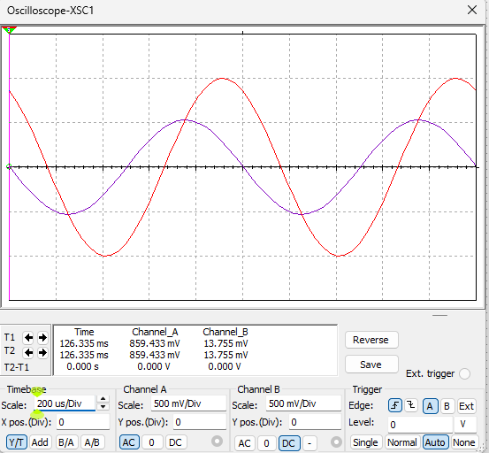

# 
Capture and simulate an RC Circuit in Multisim

Jiarui Huang(黄家睿)

202283890036

## Circuit diagram

## data table
| $V_S (V)$ | $V_R (V)$ | $V_C (V)$ | $\tau_R$ | $\tau_C$ | $T (ms)$ | $f (Hz)$ |
|-----------|-----------|-----------|----------|----------|----------|----------|
|    2V     |  1.26V    |    2V     |   0.1ms  |   0.1ms  |   1ms    |   1kHz   |
|    2V     |  605mV    |    2V     |   0.1ms  |   0.1ms  |   0.2ms  |   5kHz   |