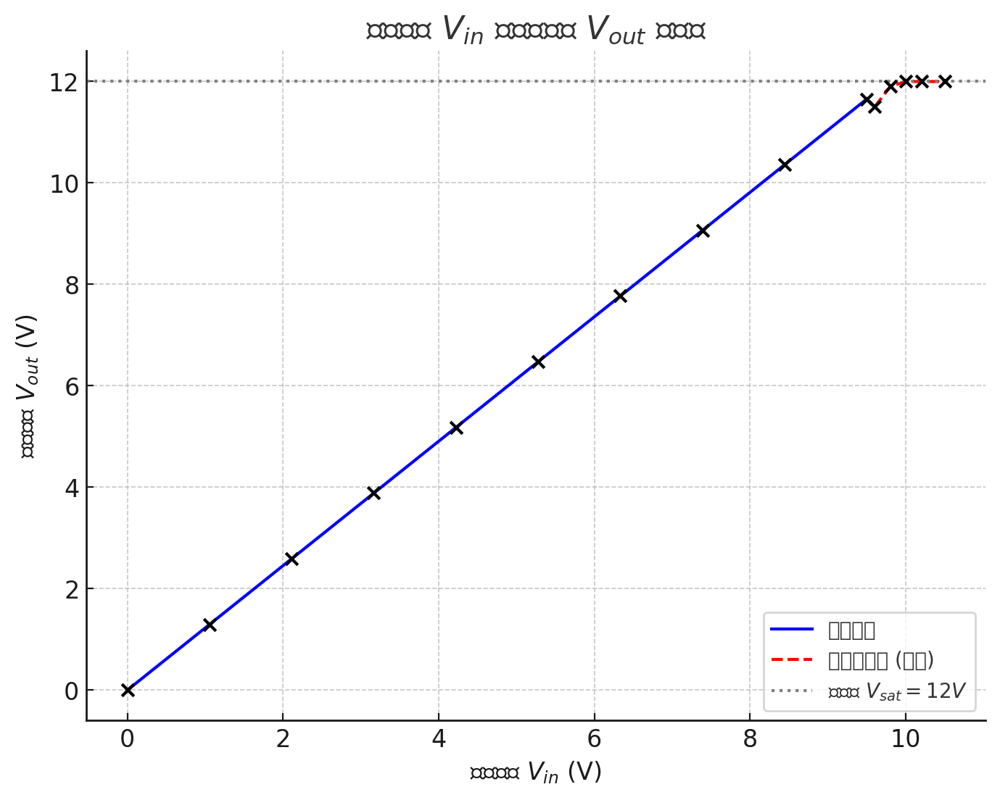

# 
# Negative feedback non-inverting voltage amplifier

Jairui Huang(黄家睿)

202283890036

## Introduction and Aim
In this section, we construct a non-inverting feedback operational amplifier circuit. This type of circuit is designed with a feedback loop that connects the output to the inverting input, which stabilizes and controls the gain of the amplifier.

The focus of this setup is to study the voltage transfer characteristics of the circuit, particularly how the feedback mechanism affects the relationship between the input voltage and the output voltage. By introducing feedback, the circuit achieves a more controlled and predictable operation within the linear region. This is because the gain of the amplifier is significantly reduced compared to an open-loop configuration, making the circuit less sensitive to small variations in the input voltage.

## Theory
Negative feedback is a fundamental concept in operational amplifier (op
amp) circuits that enhances stability, precision, and bandwidth. In a noninverting voltage amplifier, negative feedback ensures that the output voltage closely tracks the input signal while maintaining high gain and minimal distortion. This configuration amplifies the input without inverting its phase and provides advantages such as reduced sensitivity to component variations, improved linearity, and controlled gain. By applying feedback, the amplifier becomes more stable, with predictable behaviour, and operates effectively across a wide range of frequencies, making it ideal for signal amplification in precision applications.

The voltage transfer characteristic ($𝑉_𝑜$ versus $𝑉_𝑖$) for a negative feedback non-inverting op amp is shown below in Figure 2. It shows an increased linear region due to the reduction in gain. The feedback section consists of $𝑅_𝑓$ a fixed resistor in series with avariable resistor $𝑅_𝑔$. The addition of the variable resistor in series with the fixed resistor allows the feedback section to be varied between and thus allow control over the gain of the amplifier.

    

### Circuit Diagram

    

## Data table
When the circuit work in the linear area:

| &R_g$  |  $V_o$ | $V_-$ |
|-------|--------|-------|
|500| 0.665 | 0.5 |
|460| 0.665 |0.55|
|340| 0.809 | 0.7|
|260| 0.894| 0.8|
|180| 0.974 | 0.9|
|140|1.011 | 0.95|

When the circuit works in the non-linear area:

|$V_in$|$V_out|
|-----|---|
|9.6v|11.5|
|9.8v|11.9|
|10.0v|11.9|
|10.2v|11.95|

## Conclusion
This experiment has thoroughly explored the performance of the 741 operational amplifier in a negative feedback non-inverting voltage amplifier circuit. The relationship
between gain and feedback resistance has been accurately determined, and the impact of
negative feedback on stability, linearity, and bandwidth has been clearly demonstrated.
The insights gained from this experiment will significantly contribute to the design and
optimization of amplifier circuits in future practical applications.