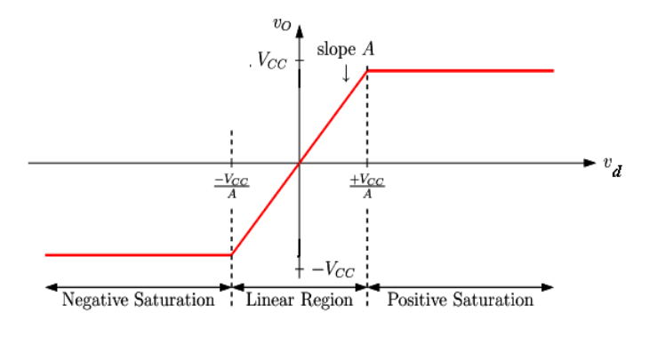
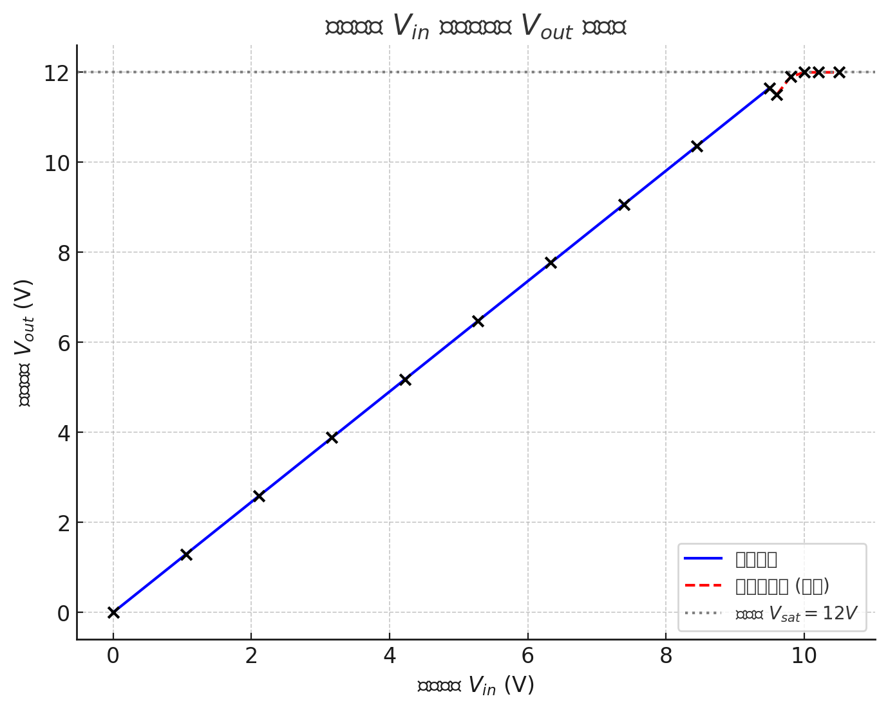

# 
 Non-inverting Amplifier Offest Nulling

Jairui Huang(黄家睿)

202283890036

## Introduce and Aim
Negative feedback is a fundamental concept in operational amplifier (op
amp) circuits that enhances stability, precision, and bandwidth. In a non-inverting voltage amplifier, negative feedback ensures that the output 
voltage closely tracks the input signal while maintaining high gain and 
minimal distortion. This configuration amplifies the input without inverting 
its phase and provides advantages such as reduced sensitivity to 
component variations, improved linearity, and controlled gain. By applying 
feedback, the amplifier becomes more stable, with predictable behaviour, 
and operates effectively across a wide range of frequencies, making it 
ideal for signal amplification in precision applications.

## Theory
The voltage transfer characteristic ($𝑉_𝑜$ versus $𝑉_𝑖$) for a negative feedback 
non-inverting op amp is shown below in Figure 2. It shows an increased 
linear region due to the reduction in gain. The feedback section consists of
$𝑅_𝑓$ a fixed resistor in series with a variable resistor $𝑅_𝑔$. The addition of the 
variable resistor in series with the fixed resistor allows the feedback 
section to be varied between and thus allow control over the gain of the 
amplifier.

    

## Experiement method and result
### The output of the $V_o$ and $V_in$
In this part we first set the $R_g$ to 500$\Omega$
,then we vary the $R_g$ between 500$\Omega$ and $100\Omega$

The output is showed below:
|The resisent of $R_g$| The output of the voltage| The negitive input of voltage|The gain|
|--|--|--|--|
|500| 31.1 | 37.3|1.2|
|400| 30.8|37|1.2|
|300| 30.6|36.7|1.2|
|200| 30.3| 36.36|1,2|
|100| 30|36.2|1.2|
|50 | 29.9| 35.9|1.2|
|0  | 29.8|35.76|1.2|

## Conclusion
This experiment has thoroughly explored the performance of the 741 operational amplifier in a negative feedback non-inverting voltage amplifier circuit. The relationship
between gain and feedback resistance has been accurately determined, and the impact of
negative feedback on stability, linearity, and bandwidth has been clearly demonstrated.
The insights gained from this experiment will significantly contribute to the design and
optimization of amplifier circuits in future practical applications.
