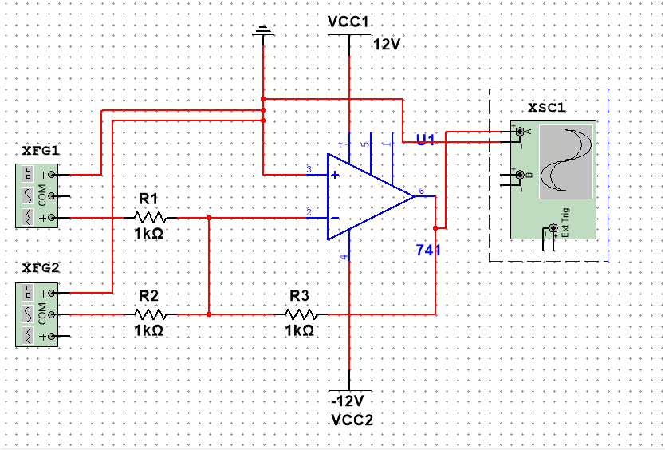
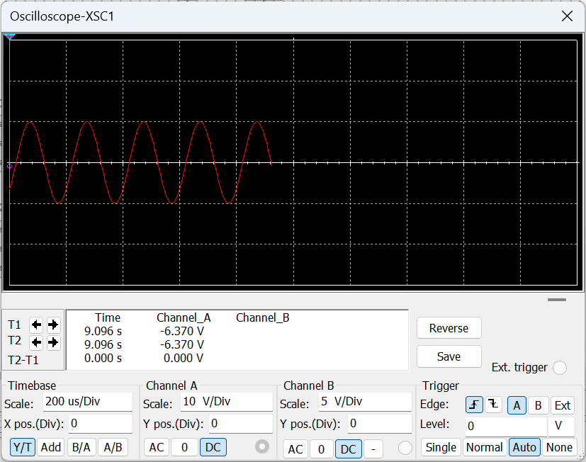

# 
Experiment on High-Frequency Noise Signal

Jairui Huang(黄家睿)

202283890036

## Introducetion and Aim
In the field of electronic circuits, the quality of signals is often interfered by noise. In order to obtain accurate and effective signals, noise processing is required. The first four tasks of this experiment focus on the generation and preliminary processing of noise signals, laying the foundation for in-depth research on signal filtering technology.

## Theory
In this experiment, high-frequency noise is generated by a function generator set to a 5kHz sine wave with 5Vpp to serve as a significant noise source. A separate function generator creates a clean signal with distinct characteristics (e.g., 50mVpp). The summing amplifier, in standard inverting operational amplifier configuration, combines these signals. With equal input and feedback resistors, it adds them with correct amplitudes and polarities. Signal superposition occurs when adding noise to the clean signal, causing amplitude and phase changes. Analyzing waveforms using an oscilloscope in Task 4 verifies signal generation and combination, providing a basis for filter evaluation. Frequency differences between the clean and noise signals impact the noisy signal. If an inverting adder is used to reverse the phase of the noisy signal (similar to the summing amplifier but with single input and unity gain), it inverts the signal by amplifying with a gain of -1, aiding in further signal manipulation and analysis. Understanding these concepts is crucial for the first four tasks and subsequent filtering.

## Experimental Method and Result

### Circuit Diagram

    

### Experiment Method
Set up two function generators: one to output a 5kHz, 5Vpp sine wave for noise approximation and the other to produce a 1kHz, 50mVpp sine wave as the clean signal. Connect an oscilloscope with appropriate timebase and voltage scale settings for signal measurement. Construct a summing amplifier using an operational amplifier (e.g., 741), with the noise signal connected to the inverting input through a 10kΩ resistor (R1), the clean signal to the non-inverting input via a 10kΩ resistor (R2), and a 10kΩ feedback resistor (Rf) for a gain of 1. If needed, add an inverting adder (another operational amplifier) with the previous output to its inverting input, ground the non-inverting input, and use a 10kΩ feedback resistor (R3) to invert the signal. Measure the clean, noise, and noisy signals directly from the sources or the amplifier outputs using the oscilloscope, record waveforms, frequencies, and amplitudes, capture screenshots or readings, tabulate data, and check for errors like incorrect connections or resistor value tolerances to ensure accurate results in the first four tasks.

### Result and Discussion

    

The clean signal at 1kHz and 50mVpp was generated as planned, showing a smooth sinusoidal waveform. The 5kHz, 5Vpp noise signal also had a regular sinusoidal pattern. The noisy signal, after adding noise to the clean signal via the summing amplifier, had a distorted waveform combining both signals' characteristics, with increased amplitude and combined frequency components. This confirms successful signal generation and combination. The distortion due to superposition emphasizes the need for filtering. The measured values matched the preset ones, verifying accuracy and proper circuit function, with minimal deviations. These results provide a basis for subsequent filtering experiments, enabling evaluation of filter effectiveness by comparing noisy signal characteristics before and after filtering.

## Conclusion
In conclusion, the first four tasks of this experiment were successfully accomplished. We generated a high-frequency noise signal and a clean signal, combined them using a summing amplifier, and thoroughly tested and analyzed the resulting noisy signal. The accurate generation and combination of signals were verified by the observed waveforms and measured parameters. This sets the stage for the next phase of the experiment, where we will explore the effectiveness of different active filters in removing the noise and recovering the clean signal, ultimately aiming to improve the quality of the electrical signal and enhance our understanding of signal processing techniques.