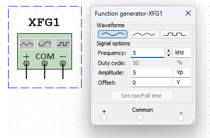

# 
First order filtering of high frequency noise

Jairui Huang(黄家睿)

202283890036

## Introduction and Aim
A noisy signal will be generated by adding a high frequency signal to a “clean” 
signal using a summing amplifier. 
Hardware filtering of the noisy signal will be tested using a number of active 
filters (first order a second order). 
Software filtering is achieved by means of capturing the signal to obtain the 
raw data which can be filtered then using a number of software tools.

The experiment demonstrates techniques to filter a noisy electrical signal.

## Theory
Signal filtering performs an important function in some electronic circuits, 
simple passive RC and RLC filter circuits are limited and so active filters are 
generally preferred. The goal of part 1 of the practical is to produce a noisy 
signal which will be filtered using both a first and second order active filter.

## Experimental Method and Results
### 1.Generate a high frequency signal to approximate noise
Set the function generator to produce a sine wave of frequency 5 kHz and 
5 Vpp,the diagram is showed below:

    

### 2.Generate a clean sigal

Set the second function generator to produce noise signal of l of 1 kHz and 2 Vpp.

    

### 3.The signal output of the two signal

The original signal by the two function gerenated is showed in the diagram:

    

### 4.The signal summing after deal

Using a summing amplifier design and implement the addition of the noise to 
the clean signal to produce a noisy signal.

The diagram is showed below:

    

The clean signal

 

    

The noise signal

## Conclusion
High-frequency noise is attenuated to a certain extent. First-order filtering has specific frequency response characteristics and can attenuate high-frequency noise that is higher than its cutoff frequency. For example, if the cutoff frequency is set as $f_n$, when the frequency of the high-frequency noise is $f_n > f_c$ higher than it, the amplitude of the noise will gradually decrease as the frequency increases. During the experiment, the reduction in the energy of the high-frequency noise part can be observed through a spectrum analyzer. However, compared with second-order filtering, the attenuation slope of first-order filtering is relatively gentle. For instance, for the same cutoff frequency setting, second-order filtering may reduce the noise amplitude more quickly in the frequency band higher than the cutoff frequency. 
