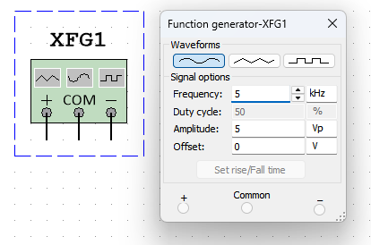
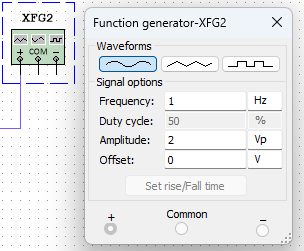
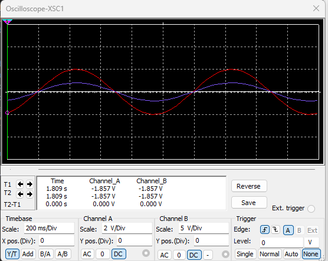
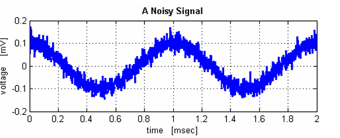

# 
second order filtering of high frequency noise

Jairui Huang(黄家睿)

202283890036

## Introduce and Aim
The experiment demonstrates techniques to filter a noisy electrical signal.
A noisy signal will be generated by adding a high frequency signal to a “clean” 
signal using a summing amplifier. 
Hardware filtering of the noisy signal will be tested using a number of active 
filters (first order a second order). 
Software filtering is achieved by means of capturing the signal to obtain the 
raw data which can be filtered then using a number of software tools.

## Theory
Signal filtering performs an important function in some electronic circuits, 
simple passive RC and RLC filter circuits are limited and so active filters are 
generally preferred. The goal of part 1 of the practical is to produce a noisy 
signal which will be filtered using both a first and second order active filter.

## Experiment Method and Results
## Experimental Method and Results
### 1.Generate a high frequency signal to approximate noise
Set the function generator to produce a sine wave of frequency 5 kHz and 
5 Vpp,the diagram is showed below:

    

### 2.Generate a clean sigal

Set the second function generator to produce noise signal of l of 1 kHz and 2 Vpp.

    

### 3.The signal output of the two signal

The original signal by the two function gerenated is showed in the diagram:

    

### 4.The signal summing after deal

Using a summing amplifier design and implement the addition of the noise to 
the clean signal to produce a noisy signal.

The diagram is showed below:

    

The clean signal

 

    

The noise signal

## Conclusion
High-frequency noise can be effectively attenuated. Second-order filtering usually has a steeper attenuation slope compared to first-order filtering. During the experiment, through spectral analysis of the signals before and after filtering, it can be found that the energy in the high-frequency part is significantly reduced. For example, if there are noise components with frequencies above 10 kHz in the original signal, after second-order filtering, these high-frequency noise components may be reduced to one-tenth or even lower than the original level, depending on the parameter settings of the filter.

The quality of the signal may be improved. For useful signals containing high-frequency noise, after second-order filtering, the clarity of the signal will be enhanced. For instance, in audio signal processing, after filtering out high-frequency noise, the sound will become purer and less harsh. In image signal processing, high-frequency noise may manifest as graininess in the image, and after second-order filtering, the image will be smoother and the details can be better presented. 